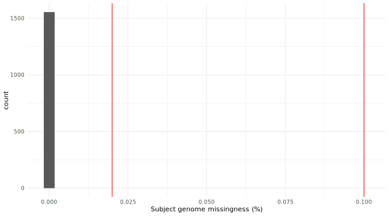
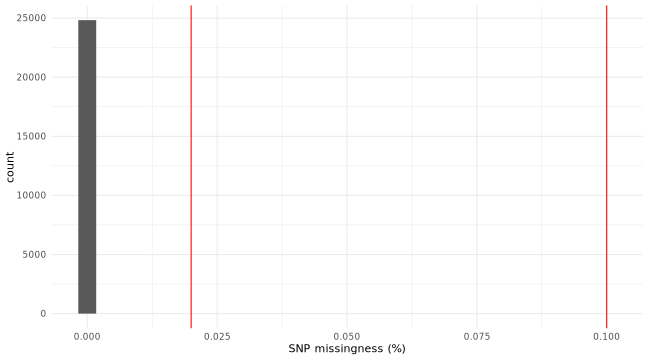

.. _tutorial_qc:

Tutorial: Quality Control Pipeline in Practice
==============================================

This tutorial provides hands-on experience running the quality control (QC)
pipeline in GDCGenomicsQC. The pipeline implements a two-stage approach:
Initial QC (sample and variant missingness filtering) followed by Standard QC
(MAF, HWE, heterozygosity, and optional sex checking).

**Estimated completion time**: 20-30 minutes

**Learning objectives**:

1. Run the Initial QC and Standard QC pipelines
2. Interpret output plots and data files
3. Configure QC thresholds for different study designs
4. Apply ancestry-specific QC workflows

----

Prerequisites
-------------

**Setup:**

Before starting, ensure you have access to Snakemake and the GDCGenomicsQC workflow.
For detailed installation instructions, see:

- :doc:`installation` - Software setup (module, conda, or other methods)
- :doc:`usage` - Running the pipeline

.. tabs::

   .. tab:: Module Load (MSI/UMN HPC)

      If your HPC has the GDC module pre-configured:

      .. code-block:: bash

          module use /path/to/GDCGenomicsQC/envs
          module load gdcgenomicsqc
          conda activate snakemake

      Verify installation:

      .. code-block:: bash

          cd GDCGenomicsQC
          snakemake --version

   .. tab:: Local Snakemake

      If you're using your own Snakemake installation:

      .. code-block:: bash

          conda activate snakemake
          cd GDCGenomicsQC

      Verify installation:

      .. code-block:: bash

          snakemake --version

**Data Requirements:**

- Reference data configured (see :doc:`tutorial_1kg_assembly`)
- Genotype data in VCF, BED, or PGEN format

.. _dag-visualization:

DAG Visualization
~~~~~~~~~~~~~~~~

The pipeline DAG up to the ``run_initialQC`` rule shows the Initial QC workflow:

.. mermaid:: dag_initialQC.mmd

The rule graph provides a cleaner view of rule dependencies:

.. mermaid:: rulegraph_initialQC.mmd

----

Required Input Files
~~~~~~~~~~~~~~~~~~~~

This step requires the following input files:

.. list-table:: QC Pipeline Input Files
   :widths: 35 65
   :header-rows: 1

   * - Input File
     - Description
   * - ``INPUT: "chr{CHR}.vcf.gz"`` (or .bed/.pgen)
     - Per-chromosome VCF, BED, or PGEN files with genotype data
   * - ``REF/1000G_highcoverage/population.txt``
     - Reference panel population labels (for ancestry QC subsets)
   * - ``REF/Homo_sapiens.GRCh38.dna.primary_assembly.fa``
     - Reference genome FASTA (if using reference allele correction)

**Input Formats Supported:**

The pipeline automatically detects format based on file extension:

+----------+------------------------------------------+
| Format   | Example Path                             |
+==========+==========================================+
| VCF      | ``/data/chr{CHR}.vcf.gz``                |
| PLINK BED| ``/data/chr{CHR}.bed``                  |
| PLINK PGEN| ``/data/chr{CHR}.pgen``                |
| Single file| ``/data/merged.bed`` (no ``{CHR}``)   |
+----------+------------------------------------------+

**Config Parameters for QC:**

.. code-block:: yaml

    INPUT: "/path/to/data/chr{CHR}.vcf.gz"  # Per-chromosome VCF
    OUT_DIR: "/path/to/output"
    REF: "/path/to/reference"

    # QC thresholds
    relatedness:
        method: "king"  # "0" for none, "king" for removal

    SEX_CHECK: true  # Enable/disable sex verification
    GRM: true  # Compute genetic relationship matrix

**See also:** :doc:`usage` for configuration options, :doc:`installation` for software setup.

----

Lab Exercise: Running QC Pipeline

Step 1: Create Configuration File
~~~~~~~~~~~~~~~~~~~~~~~~~~~~~~~~~

Create a configuration file for QC:

.. code-block:: bash

    mkdir -p ~/qc_lab
    cd ~/qc_lab
    cat > config_qc.yaml << 'EOF'
    INPUT: "/path/to/data/chr{CHR}.vcf.gz"
    OUT_DIR: "/path/to/output/directory"
    REF: "/path/to/reference/data"

    relatedness:
        method: "0"

    SEX_CHECK: true
    thin: true
    conda-frontend: mamba
    EOF

Key parameters:

- ``SEX_CHECK``: Enable/disable sex verification (default: true)
- ``relatedness.method``: Relatedness filtering method ("0" for none, "king" or "primus" for removal)

Step 2: Run Initial QC
~~~~~~~~~~~~~~~~~~~~~~~

.. tabs::

   .. tab:: Module Load (MSI/UMN HPC)

      .. code-block:: bash

          cd GDCGenomicsQC/workflow
          gdcgenomicsqc --configfile ../config_qc.yaml full/initialFilter.pgen -j 10

   .. tab:: Local Snakemake

      .. code-block:: bash

          cd GDCGenomicsQC/workflow
          snakemake --profile=../profiles/hpc \
              --configfile ../config_qc.yaml \
              full/initialFilter.pgen \
              -j 10

The Initial QC stage performs:

1. **Sample missingness (initial)**: Removes samples with >10% missing genotypes (``--mind 0.1``)
2. **Variant missingness**: Removes variants with >2% missingness (``--geno 0.02``)
3. **Sample missingness (final)**: Removes samples with >2% missingness (``--mind 0.02``)
4. **LD pruning**: Creates pruned dataset for downstream analyses (``--indep-pairwise 500 10 0.1``)

Step 3: Run Standard QC
~~~~~~~~~~~~~~~~~~~~~~~

.. tabs::

   .. tab:: Module Load (MSI/UMN HPC)

      .. code-block:: bash

          gdcgenomicsqc --configfile ../config_qc.yaml full/standardFilter.pgen -j 10

   .. tab:: Local Snakemake

      .. code-block:: bash

          snakemake --profile=../profiles/hpc \
              --configfile ../config_qc.yaml \
              full/standardFilter.pgen \
              -j 10

The Standard QC stage applies additional filters:

1. **Minor Allele Frequency (MAF)**: Removes variants with MAF < 1% (``--maf 0.01``)
2. **Hardy-Weinberg Equilibrium (HWE)**: Removes variants failing HWE at p < 1×10⁻⁶ (discovery) and p < 1×10⁻¹⁰ (validation)
3. **Heterozygosity check**: Identifies samples with FWER > 3 standard deviations from mean
4. **Sex check**: Optionally verifies reported sex matches genetic sex

Step 4: Run Ancestry-Specific QC
~~~~~~~~~~~~~~~~~~~~~~~~~~~~~~~~

After ancestry classification, run QC on specific ancestry groups:

.. tabs::

   .. tab:: Module Load (MSI/UMN HPC)

      .. code-block:: bash

          gdcgenomicsqc --configfile ../config_qc.yaml EUR/standardFilter.pgen -j 10

   .. tab:: Local Snakemake

      .. code-block:: bash

          snakemake --profile=../profiles/hpc \
              --configfile ../config_qc.yaml \
              EUR/standardFilter.pgen \
              -j 10

Available subsets are dynamically determined from classification results.

Visualizations
~~~~~~~~~~~~~~

**Reference Space (PCA)**: ``images/PC_reference_space.svg``

- Reference panel samples in PC space with density contours
- Shows how target samples map to known ancestry groups

**Reference Space (UMAP)**: ``images/UMAP_reference_space.svg``

- Reference panel samples in UMAP embedding with density contours
- Nonlinear visualization of ancestry structure

----

Interpreting Pipeline Outputs

Sample Missingness Plot
~~~~~~~~~~~~~~~~~~~~~~~

**File**: ``{subset}/figures/smiss.svg``

The sample missingness histogram shows the distribution of missing data per individual.

- X-axis: Percentage of genotype calls missing per sample
- Red vertical lines: Threshold cutoffs (10% initial, 2% final)
- Samples to the right of the rightmost line are removed

**Note**: Since we used synthetic and (in case of the R25 data) imputed data, we don't expect to see any missingness in this exercise.

Standard interpretation:

- **Sharp peak at low values**: Good quality data
- **Long right tail**: Problematic samples requiring investigation
- **Bimodal distribution**: Possible batch effects or technology issues

Variant Missingness Plot
~~~~~~~~~~~~~~~~~~~~~~~~

**File**: ``{subset}/figures/vmiss.svg``

The variant missingness histogram shows the distribution of missing data per SNP.

- X-axis: Percentage of samples missing genotype call per variant
- Red vertical lines: Threshold cutoffs
- Variants to the right of the line are removed

**Note**: Since we used synthetic and (in case of the R25 data) imputed data, we don't expect to see any missingness in this exercise.

Standard interpretation:

- **Concentrated at low values**: Clean variant calling
- **Long right tail**: Possible strand flip issues, poor quality regions, or structural variants

Unplotted Output Files
~~~~~~~~~~~~~~~~~~~~~~~

The QC pipeline generates many intermediate files for detailed analysis:

**Initial QC Outputs**:

+-----------------------------------+----------------------------------------+
| File                              | Description                            |
+===================================+========================================+
| ``initialFilter.pgen/.pvar/.psam``| Merged, filtered dataset               |
+-----------------------------------+----------------------------------------+
| ``initialFilter.LDpruned.*``      | LD-pruned dataset for PCA/relatedness |
+-----------------------------------+----------------------------------------+
| ``initial.smiss``                 | Sample missingness table              |
+-----------------------------------+----------------------------------------+
| ``initial.vmiss``                 | Variant missingness table             |
+-----------------------------------+----------------------------------------+

**Standard QC Outputs**:

+-----------------------------------+----------------------------------------+
| File                              | Description                            |
+===================================+========================================+
| ``standardFilter.pgen/.pvar/.psam``| Final filtered dataset                |
+-----------------------------------+----------------------------------------+
| ``standardFilter.LDpruned.*``     | Final LD-pruned dataset               |
+-----------------------------------+----------------------------------------+
| ``MAF_check.afreq``               | Allele frequency table                |
+-----------------------------------+----------------------------------------+
| ``zoomhwe.hwe``                   | Variants failing HWE p < 1×10⁻⁵       |
+-----------------------------------+----------------------------------------+
| ``indepSNP.prune.in``             | Independent SNPs for heterozygosity   |
+-----------------------------------+----------------------------------------+
| ``R_check.het``                   | Heterozygosity rate per sample        |
+-----------------------------------+----------------------------------------+
| ``fail-het-qc.txt``               | Samples failing heterozygosity filter |
+-----------------------------------+----------------------------------------+
| ``sex_discrepancy.txt``           | Samples with sex check problems       |
+-----------------------------------+----------------------------------------+

**Sample contents of** ``initial.smiss``:

+--------+----------+----------+--------+
| IID    | FID      | F_MISS   | N_MISS |
+========+==========+==========+========+
| S001   | FAM001   | 0.001    | 150    |
+--------+----------+----------+--------+
| S002   | FAM001   | 0.008    | 1200   |
+--------+----------+----------+--------+

**Sample contents of** ``R_check.het``:

+--------+----------+--------+--------+
| IID    | FID      | O.HOM. | N.NM.  |
+========+==========+========+========+
| S001   | FAM001   | 2500   | 3000   |
+--------+----------+----------+--------+
| S002   | FAM001   | 2450   | 3000   |
+--------+----------+----------+--------+

The heterozygosity rate is calculated as: ``(N.NM. - O.HOM.) / N.NM.``

----

Discussion Points: Multi-Ancestry and Admixed Study Designs
-------------------------------------------------------------

These questions explore QC considerations for diverse and admixed populations:

1. **Ancestry-specific allele frequencies**: The MAF filter (default 1%) may remove
   informative variants in population-specific contexts. How should MAF thresholds
   differ between ancestry groups? Should multi-ancestry studies use uniform or
   group-specific thresholds?

2. **HWE assumptions**: HWE testing assumes a randomly mating population. For
   admixed individuals, this assumption is violated. Should HWE filters be applied
   before or after ancestry classification? How do systematic departures from HWE
   in admixed populations affect downstream analysis?

3. **Heterozygosity in admixed samples**: Admixed individuals have higher
   heterozygosity than homogeneous populations. Does the 3-SD threshold appropriately
   capture excess heterozygosity as an outlier versus natural admixture? How does
   this affect false positive rates?

4. **Missingness patterns**: Samples with high global ancestry proportions may
   have higher missingness if reference panels poorly represent their ancestry.
   How should missingness thresholds account for reference panel coverage across
   diverse populations?

5. **Sex chromosome handling**: The pseudoautosomal regions and sex chromosome
   ploidy differ between ancestries. How should X-chromosome heterozygosity filters
   be adjusted for multi-ancestry studies?

6. **Relatedness in family-structured populations**: For studies with family
   structure across ancestries, should KING or PRIMUS be used? How does population
   structure affect kinship coefficient estimates?

7. **Differential QC power**: Some ancestry groups may have more variants removed
   due to technology bias (e.g., array density). How does differential QC success
   affect downstream GWAS power and potential for bias?

8. **Strand alignment**: Poorly aligned variants show as missing in specific
   ancestry groups. How do you distinguish true missingness from strand issues
   in multi-ancestry data?

For theoretical foundations—including population genetics principles, statistical
tests for QC metrics, and best practices for diverse populations—refer to the
accompanying lecture materials.

----

Next Steps
---------

After completing this tutorial, proceed to:

- :doc:`tutorial_ancestry_classification` - Classify ancestry using the QC-filtered data
- :doc:`tutorial_heritability` - Estimate heritability using QC-filtered genotypes

**See also:**

- :doc:`installation` - Software setup (if not already done)
- :doc:`usage` - Running the full pipeline
- :doc:`genomics` - Technical details on QC methods
